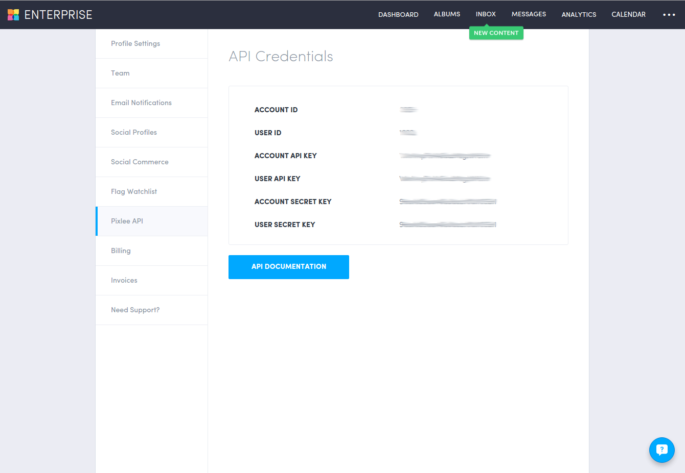
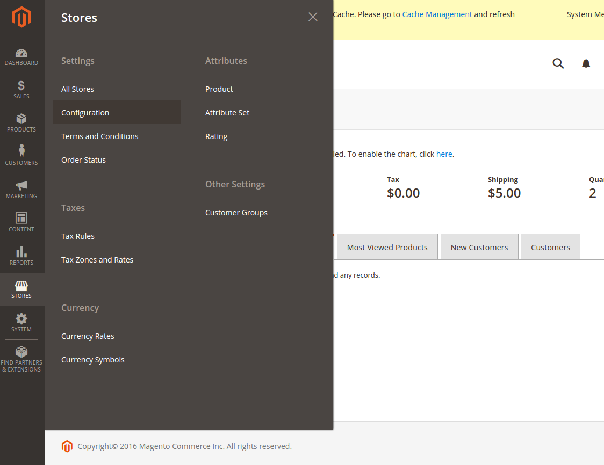
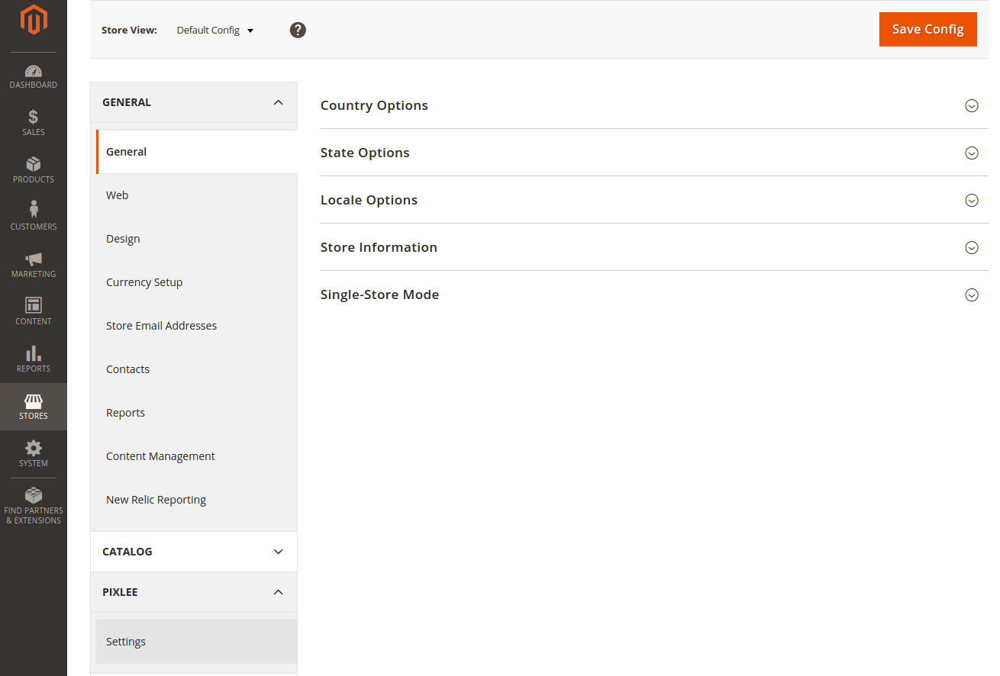
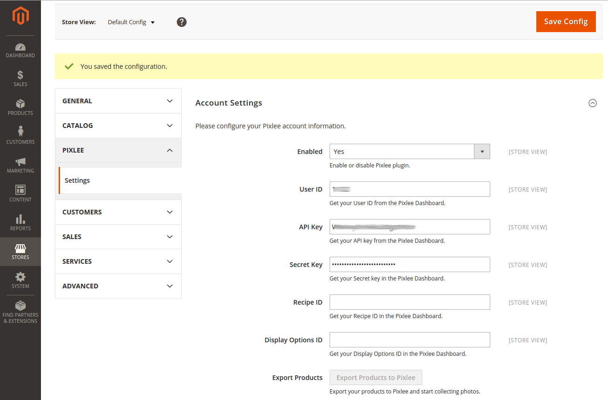
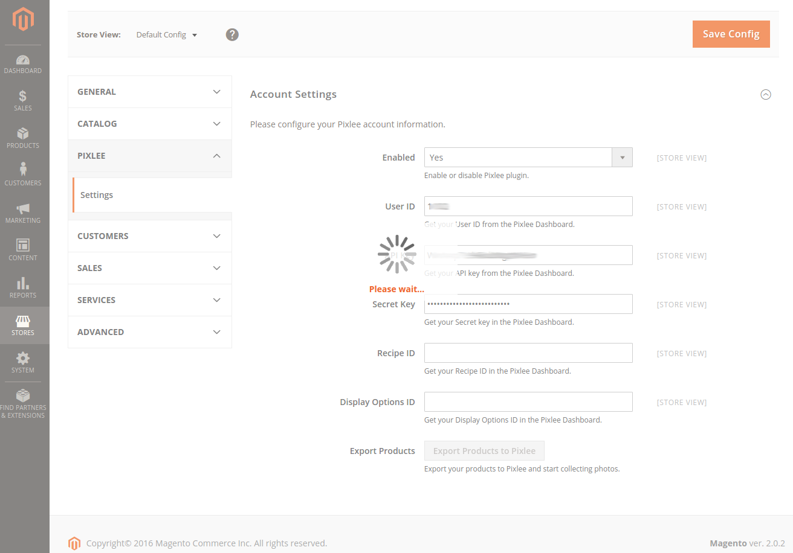

# 1. Module Installation #

For the rest of this section, we'll refer to $MAGENTO_HOME as the root directory of your Magento 2 installation.

The commands provided in the code blocks that follow were written with an Ubuntu server in mind,
but should be able to be extrapolated to other operating systems. If you're comfortable enough with the
command line to be installing modules manually, this is probably not an issue for you.

## 1.1. Extract the Pixlee Module .zip file ##

```
$ unzip Pixlee_Magento2.zip
```

The output should be a Pixlee folder:
```
$ ls
Pixlee  Pixlee_Magento2.zip
```

## 1.2 Create a $MAGENTO_HOME/app/code/Pixlee folder, and copy the extracted Pixlee folder into it ##

```
$ mkdir -p $MAGENTO_HOME/app/code/Pixlee
$ cp -r Pixlee $MAGENTO_HOME/app/code/Pixlee/
```

That is, you should end up with a $MAGENTO_HOME/app/code/Pixlee/Pixlee folder

If the module was installed correctly, you should be able to access the following file:
```
$MAGENTO_HOME/app/code/Pixlee/Pixlee/composer.json
```

In addition, running the magento module:status command should show that Pixlee_Pixlee is installed
but not yet enabled:
```
$ $MAGENTO_HOME/bin/magento module:status
List of enabled modules:
Magento_Store
Magento_AdvancedPricingImportExport
Magento_Directory
...
Magento_Wishlist
Magento_WishlistSampleData

List of disabled modules:
Pixlee_Pixlee
```

## 1.3. Enable the newly installed Pixlee module: ##

```
$ $MAGENTO_HOME/bin/magento module:enable Pixlee_Pixlee
```

## 1.4. Run the magento upgrade command: ##

```
$ $MAGENTO_HOME/bin/magento setup:upgrade
```

## 1.5. In case of permissions error ##

Chances are, if you reload the Magento 2 storefront right now, you'll get a blank page due to a
permissions error. If you do, do the following to set the desired permissions across
the entire Magento 2 folder.

You might remember this from the Magento 2 installation process:
```
$ cd $MAGENTO_HOME
$ sudo find . -type d -exec chmod 770 {}
$ sudo find . -type f -exec chmod 660 {}
$ sudo chmod u+x bin/magento
```

<!-- Manually inserting the LaTeX \newpage command -->
\newpage

# 2. Configuring Pixlee #

## 2.1. Get your credentials from the Pixlee Control Panel ##

1. Log in to [http://pixlee.com](http://pixlee.com)
2. Click on the ellipsis (...) on the top right
3. Navigate to **Settings**, then **Pixlee API**
4. You'll need the **User ID,** **Account API Key,** and **Account Secret Key** fields


<br />

<!-- Manually inserting the LaTeX \newpage command -->
\newpage

## 2.2. Set up Pixlee's Configuration in Magento 2

1. In the Admin Dashboard, click on the **Stores** icon in the lefthand navigation


<br />

2. Click on **Configuration** under the **Settings** section
3. **Pixlee** should have its own slideout in the **Configuration** page, click on **Settings** under it


<br />

4. Fill in the form and click **Save Config**


<br />

## 2.3. Export Products

Click on **Export Products**


<br />
