# 1. Overview #

## 1.1. Prerequisites ##

I do certify my company is the original creator of the extension’s code.
Pixlee Inc

We support the following Magento versions:

-  CE 2.0.2

We support the following web browsers:

-  Chrome
-  Firefox
-  Safari

The extension follows the Magento PHP coding standards.

## 1.2. Purpose ##

The purpose of the Vendor Payment Extension custom module is to provide the following capabilities:

- Ability to export products from Magento to Pixlee’s API
- Ability to create and update products from Magento to Pixlee’s API
- Analytics information for Add to Cart, Remove from Cart and Checkout process

## 1.3. Requirements ##

The following user stories and use cases were created for this custom module.

- Add to Cart
    - User has identified an item to buy and clicked on ‘Add to Cart’. Item was successfully added into the cart and analytics data was sent to Pixlee
- Remove from Cart
    - User has identified an item to remove from cart and clicked on ‘Remove’. Item was successfully removed from the cart and analytics data was sent to Pixlee
- Checkout
    - User has decided to checkout the current items in the cart and clicked on the cart. Cart with the current list of items was loaded and analytics data was sent to Pixlee
- Add Product
    - Administrator decided to add a new product in the catalog. Administrator filled up the product information on the add product page and clicked on submit. The product information was sent to Pixlee API and the product is also created on Pixlee platform.
- Update Product
    - Administrator decided to update a product in the catalog. Administrator updated the product information on the update product page and clicked on submit. The updated product information was sent to Pixlee API and the product is also updated on Pixlee platform.
- Export Products
    - Administrator decided to export the current products in the system to Pixlee. Administrator goes to the ‘Pixlee Account Configuration’ page and clicked on the ‘Export Products to Pixlee’ button.

## 1.4. Solution Impact Scheme ##

The custom module adds observers to listen for cart interaction events. When products are added to the cart and removed from the cart, as well as when
a user begins or ends the checkout process from a cart, an observer handles the event and sends a POST to a Pixlee endpoint.

In addition, a new "Pixlee" section is added to the "Configuration" page in under "Settings" in the "Stores" navigation item in the Magento 2 admin panel.
From there, the administrator can export products from Magento 2 to the Pixlee platform.

## 1.5. Process Overview ##

Following is an overview of the customizations made to the purchasing process.
1. Add product to cart - Observer listens to the event, and sends product information to Pixlee
2. Remove product from cart - Observer listens to the event, and sends product information to Pixlee
3. Checkout cart - Observer listens to the event, and sends cart information to Pixlee
4. Complete checkout - Observer listens to the event, and sends cart information to Pixlee

<!-- Manually inserting the LaTeX \newpage command -->
\newpage

## 1.6. Diagrams ##

### 1.6.1. Add to Cart Analytics ###

All customers' add to cart behavior is unaffected. The observers in the backend are the ones responsible
for firing events to the Pixlee endpoints.

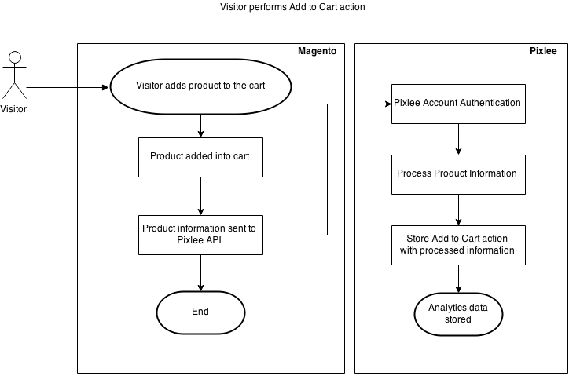
 

<!-- Manually inserting the LaTeX \newpage command -->
\newpage

### 1.6.2. Remove from Cart Analytics ###

All customers' remove from cart behavior is unaffected. The observers in the backend are the ones responsible
for firing events to the Pixlee endpoints.

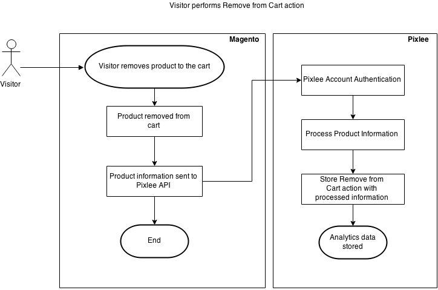
 

<!-- Manually inserting the LaTeX \newpage command -->
\newpage

### 1.6.3. Checkout Analytics ###

All customers' checkout behavior is unaffected. The observers in the backend are the ones responsible
for firing events to the Pixlee endpoints.

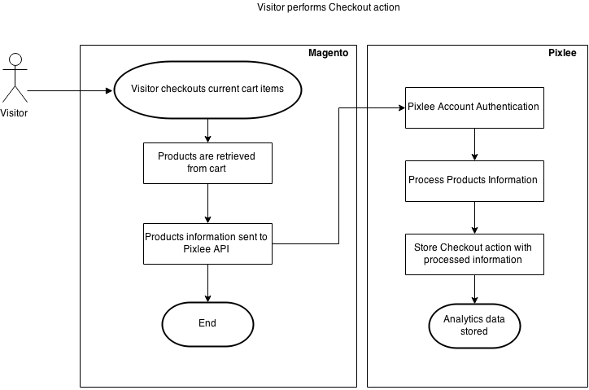
 

### 1.6.4. Create Product ###

The administrators' product creation behavior is unaffected. On pressing save, an observer handles the
event and fires another event to the Pixlee endpoint.

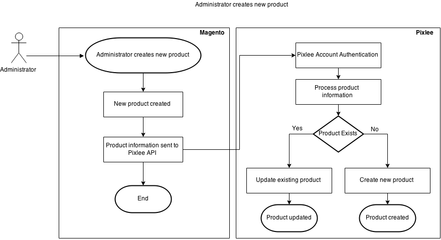
 

### 1.6.5. Update Product ###

The administrators' product update behavior is unaffected. On pressing save, an observer handles the
event and fires another event to the Pixlee endpoint.

### 1.6.6. Export Products ###

Product exports is a new functionality provided by the Pixlee module, and has the specific purpose
of exporting product data from Magento 2 to Pixlee.
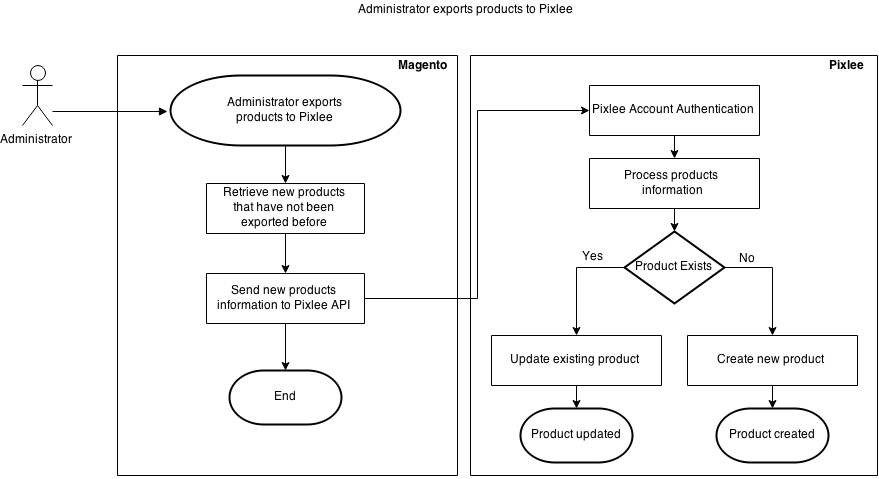
 

# 2. Custom Module Architecture #

## 2.1. Class Diagrams of Models ##

1.  Pixlee_Base_Model_Product_Album

    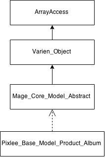
     

<!-- Manually inserting the LaTeX \newpage command -->
\newpage

## 2.2. Sequence Diagrams ##

1.  Use case: A customer adds a product to the cart and product data is sent to the Pixlee API.

    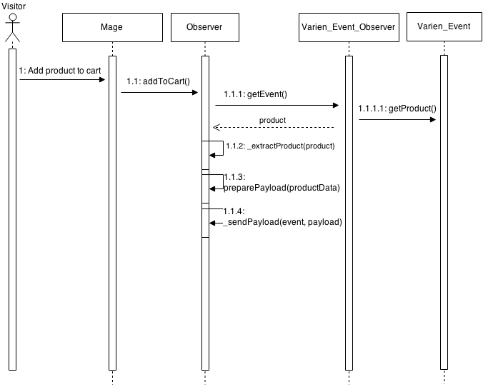
     

<!-- Manually inserting the LaTeX \newpage command -->
\newpage

2.  Use case: A customer removes a product from the cart and the product data is sent to the Pixlee API.

    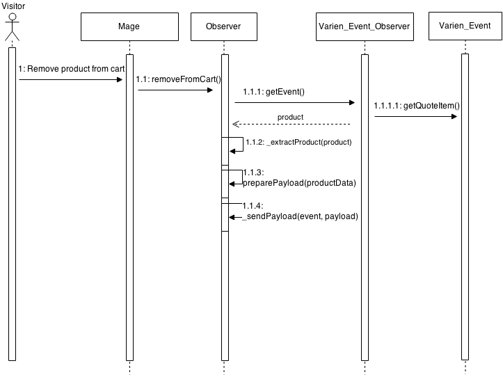
     

3.  Use case: A customer begins the checkout process from the cart and the products data is sent to the Pixlee API.

    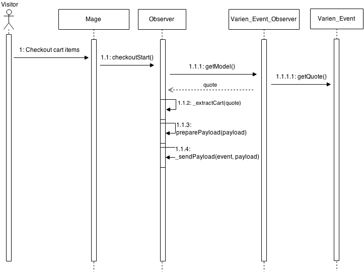
     

4.  Use case: Administrator creates a Magento product and the product is also created on the Pixlee platform.

    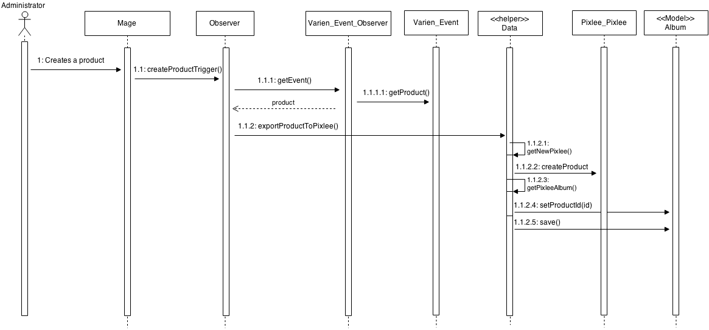
     

5.  Use case: Administrator updates a Magento product and the product is also updated on the Pixlee platform.

    
     

<!-- Manually inserting the LaTeX \newpage command -->
\newpage

6.  Use case: Administrator exports all the Magento products and the products data is sent to the Pixlee API for importing.

    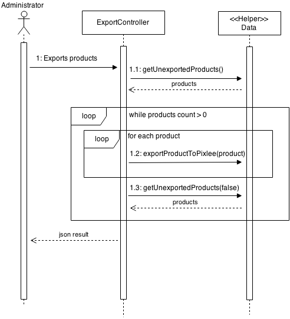
     

<!-- Manually inserting the LaTeX \newpage command -->
\newpage

## 2.3. Database Structure Diagram ##

1.  Table Relation Diagram

    A new table was added and it has no relation with the native Magento tables.

    | px_product_albums     |                 |
    | :-------------------- | :-------------- |
    | PK                    | id              |
    |                       | product_id      |
    |                       | pixlee_album_id |

2.  New Database Fields

    | Table Name        | Field Name      | Field Type |
    | :---------------- | :-------------- | :--------- |
    | px_product_albums | id              | int        |
    | px_product_albums | product_id      | int        |
    | px_product_albums | pixlee_album_id | int        |

## 2.4. Frontend Functionality Impact ##

No frontend functionality is impacted, as all logic is handled by observers.

## 2.5. Backend Functionality Impact ##

No frontend functionality is impacted, as all logic is handled by observers.

<!-- Manually inserting the LaTeX \newpage command -->
\newpage

# 3. List of Magento Events Used #

The events in the table below are observed by the following classes:

- Pixlee/Pixlee/Observer/AddToCartObserver.php
- Pixlee/Pixlee/Observer/CheckoutSuccessObserver.php
- Pixlee/Pixlee/Observer/RemoveFromCartObserver.php
- Pixlee/Pixlee/Observer/CheckoutStartObserver.php
- Pixlee/Pixlee/Observer/CreateProductTriggerObserver.php
- Pixlee/Pixlee/Observer/ValidateCredentialsObserver.php

| Event Name                                           | Observer                     |
| :--------------------------------------------------- | :--------------------------- |
| controller_action_predispatch_checkout_onepage_index | CheckoutStartObserver        | 
| multishipping_checkout_controller_success_action     | CheckoutSuccessObserver      |
| checkout_cart_add_product_complete                   | AddToCartObserver            | 
| sales_quote_remove_item                              | RemoveFromCartObserver       |
| catalog_product_save_after                           | CreateProductTriggerObserver |

# 4.  List of Files Rewritten #

No files were rewritten. All of the functionality of this module is additive to the base Magento 2 platform.

# 5.  System Restrictions and Limitations #

The functionalities provided by this module depend on the Pixlee API endpoints being available.
